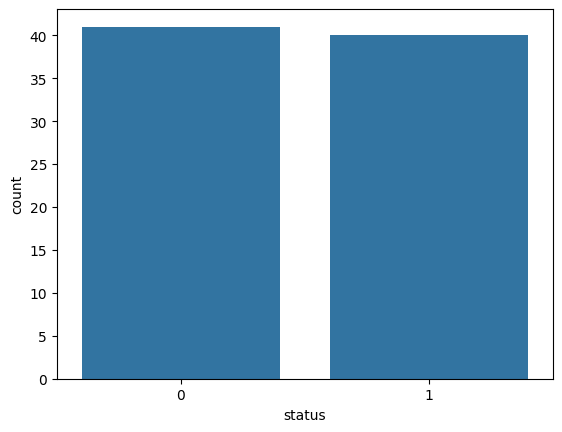

# Parkinson's Disease Detection Using Voice Recordings

This project explores whether acoustic features extracted from voice recordings can be used to distinguish between individuals with Parkinson's disease and healthy controls using machine learning.

The project was completed as part of the ThinkNeuro Software Engineering Practicum by Belina Pogace-Velca, Isa de Sabrit, and Adithya Gopavaram.

---

## Project Overview

Parkinson's disease can affect speech and vocal characteristics. In this project, voice recordings were processed to extract acoustic features, which were then used to train and evaluate several machine learning classifiers.

The aim was to compare different models and determine which provided the most reliable classification performance.

---

## Dataset

The dataset contains voice recordings from individuals with Parkinson's disease and healthy controls.

- **81 usable voice recordings**
- **41 healthy controls**
- **40 participants with Parkinson's disease**
- `0` = Healthy Control
- `1` = Parkinson's Disease

Dataset source:  
[Voice Samples for Patients with Parkinson's Disease and Healthy Controls – Figshare](https://figshare.com/articles/dataset/Voice_Samples_for_Patients_with_Parkinson_s_Disease_and_Healthy_Controls/23849127)

### Class Distribution



---

## Feature Extraction

Acoustic features were extracted from each voice recording before model training.

The extracted features included:

- Fundamental frequency measures
- Jitter
- Shimmer
- Harmonic and noise measures
- Non-linear voice measures such as RPDE, DFA and PPE

A total of **22 acoustic features** were used for machine learning.

---

## Machine Learning Models

Seven classification algorithms were explored:

- Logistic Regression
- Decision Tree
- Random Forest
- Support Vector Machine (SVM)
- Naive Bayes
- K-Nearest Neighbours (KNN)
- XGBoost

---

## Model Evaluation

Models were evaluated using metrics including:

- Accuracy
- Precision
- Recall
- F1-score
- Confusion matrix

To obtain a more reliable estimate of model performance, selected models were also evaluated using **5-fold stratified cross-validation**.

## Cross-Validation Results

The mean cross-validation accuracies were:

| Model | Mean CV Accuracy |
|---|---:|
| Logistic Regression | 62.94% |
| Decision Tree | 64.19% |
| SVM | 65.59% |
| **Random Forest** | **73.97%** |
| Naive Bayes | 60.44% |
| KNN | 59.56% |
| XGBoost | 65.62% |


Random Forest achieved the highest mean cross-validation accuracy of the models re-evaluated using 5-fold cross-validation.

Its performance was approximately:

**73.97% ± 5%**

---

## Final Model — Random Forest

Random Forest was selected as the final classifier because it demonstrated strong performance on the test data and the highest mean cross-validation accuracy among the models evaluated using 5-fold cross-validation.

### Random Forest Confusion Matrix


---

## Feature Relationships

The correlation heatmap below shows relationships between the extracted acoustic features.


---

## Project Workflow

```text
Voice Recordings
        ↓
Acoustic Feature Extraction
        ↓
Dataset Creation
        ↓
Machine Learning Models
        ↓
Model Evaluation
        ↓
5-Fold Cross-Validation
        ↓
Random Forest Selected
        ↓
Interactive Prediction Demo
